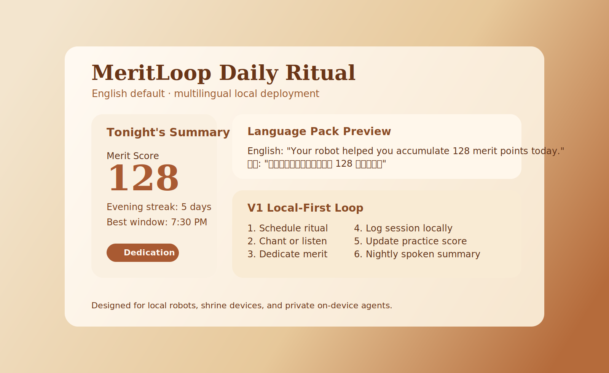

# MeritLoop / 念伴

**English first. Localized by default. Built for Buddhist ritual companionship.**  
**英文为默认主语言，并支持按本地系统自动切换。**

MeritLoop is a local-first Buddhist ritual companion concept. It helps people chant on schedule, dedicate intentions, track daily practice, and receive a nightly merit summary through a calm AI-powered robot, shrine device, or on-device agent.

念伴（MeritLoop）是一个本地优先的佛教修行陪伴 Agent 概念。它帮助用户定时念经、自动回向、记录日课，并在夜间播报“今日功德值”。

## Why It Feels Different

- Local-first by design: version one can work without servers
- Ritual-native: built around chanting, dedication, rhythm, and remembrance
- Merit mechanic: daily practice becomes visible through a transparent score
- Expandable: future-ready for community, temple partnerships, and family sync
- Multilingual: English default, with localization paths for Chinese, Japanese, Thai, and other Buddhist regions

## Core Experience

Version one focuses on a fully local ritual loop:

1. A scheduled reminder or automatic ritual start
2. Chanting, scripture playback, or guided silent practice
3. Dedication generation or playback
4. Local logging of the completed session
5. A nightly spoken summary of today's merit score and streak

中文版理解：

1. 固定时间提醒或自动开始
2. 念经、播经、静坐引导
3. 自动回向
4. 本地记录
5. 晚上播报今日功德值和连续天数

## Merit Score

The merit score is framed as a **practice index**, not a doctrinal claim.

Suggested inputs:
- Chant completed
- Dedication completed
- Scripture reading finished
- Silent sitting completed
- Daily consistency streak
- Session completion quality

Example outputs:

> Today your robot helped you accumulate 128 merit points.  
> Your evening practice streak is now 5 days.  
> Your strongest practice window this week was 7:30 PM.

中文说明：  
“功德值”在产品里是修行行为指数，用来增强持续性和陪伴感，不宣称它等同于真实宗教意义上的功德证明。

## Language Strategy

Default product language:
- English

Recommended launch languages:
- English
- Simplified Chinese
- Traditional Chinese
- Japanese
- Thai

Recommended next-wave languages:
- Korean
- Vietnamese
- Sinhala

Localization principle:
- The product should follow the host system language when deployed locally.
- If the system language is unsupported, it should fall back to English.
- Ritual text, audio packs, and dedication templates should be region-aware.

See [LOCALIZATION.md](./LOCALIZATION.md) for the full language strategy.

## What Ships In V1

- Local scheduling
- Local scripture/audio library
- Daily chanting flow
- Dedication templates
- Merit-score engine
- Nightly spoken summary
- Household profile support

See [PRODUCT_SPEC.md](./PRODUCT_SPEC.md) for the structured spec.

## Future Expansion

- Family sync
- Shared merit boards
- Community chanting rooms
- Temple channels
- Offerings, bookings, and event services
- Multi-device and cloud sync

## Safety Boundaries

- The AI does not claim enlightenment, ordination, or spiritual authority.
- The merit score does not claim literal karmic proof.
- The product does not replace clergy, temples, or healthcare support.

## Best Brand Direction

- Primary Chinese name: `念伴`
- Primary English name: `MeritLoop`

Bolder alternative:
- Chinese: `赛博念经`
- English: `BodhiLoop`

## Repository Contents

- Core skill: [buddhist-agent-product/SKILL.md](./buddhist-agent-product/SKILL.md)
- Use cases: [buddhist-agent-product/references/use-cases.md](./buddhist-agent-product/references/use-cases.md)
- Naming and gap review: [buddhist-agent-product/references/naming-and-gaps.md](./buddhist-agent-product/references/naming-and-gaps.md)
- Product spec: [PRODUCT_SPEC.md](./PRODUCT_SPEC.md)
- Localization plan: [LOCALIZATION.md](./LOCALIZATION.md)

## One-Line Pitch

MeritLoop is a local-first ritual companion that turns chanting, dedication, and reflection into a daily spiritual rhythm.
